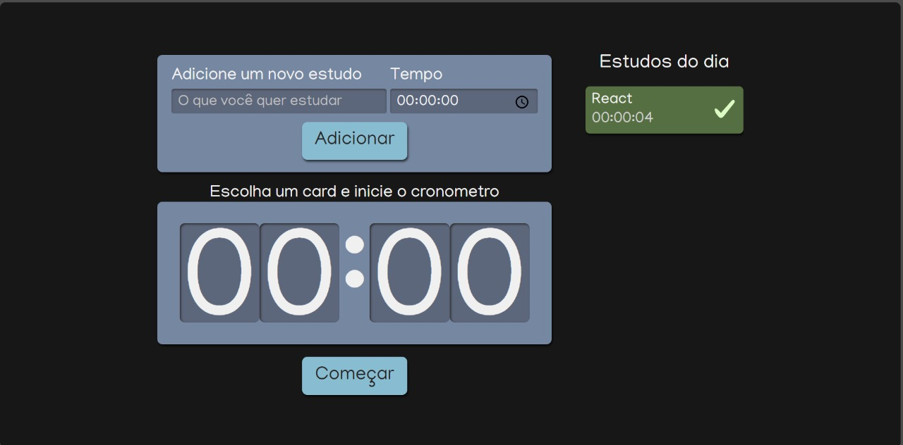
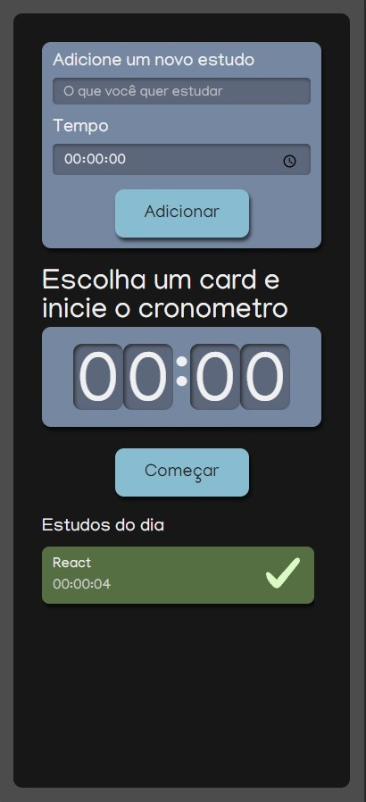

<p align="center">Projeto desenvolvido no curso Fundamentos de React: React com Typescript oferecido pela Alura.</p>

<p align="center">
 <a href="#pré-requisitos">Pré Requisitos</a> •
 <a href="#rodando-o-mobile">Rodando a aplicação</a> •
 <a href="#tecnologias">Tecnologias</a> •
 <a href="#autor">Autor</a>
</p>

<h1 align="center">
  
  
</h1>

### Pré-requisitos

Antes de começar, você vai precisar ter instalado em sua máquina as seguintes ferramentas:
[Git](https://git-scm.com), [Node.js](https://nodejs.org/en/).

Além disto é bom ter um editor para trabalhar com o código como [VSCode](https://code.visualstudio.com/).

### Rodando o Projeto

```bash
# Clone este repositório
$ git clone https://github.com/FernandoHenriqueSouza/Studies.git

# Acesse a pasta do projeto no terminal/cmd
$ cd alura-studies

# Instale as dependências
$ npm install

# Executar o código
$ npm start
```
### Tecnologias

As seguintes ferramentas foram usadas na construção do projeto:

- [ReactJS]
- [TypeScript]
- [HTML]
- [CSS]


### Autor


Made with 💜 by FERNANDO 👋

[](https://www.linkedin.com/in/fernando-henrique-de-souza-180552155/)
=======

